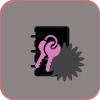

# SecurePasswd_MGMT

<p align="center">
  
</p>

**SecurePasswd_MGMT** is a modern, cross-platform password manager and two-factor authenticator (TOTP) designed with state-of-the-art security. It provides a secure solution for managing passwords and 2FA tokens locally, with both a fast command-line interface (CLI) and a user-friendly graphical user interface (GUI).

## Key Security Features

- **End-to-End Encryption:** All sensitive data is encrypted at rest in a SQLCipher encrypted database.
- **State-of-the-Art Key Derivation:** **Argon2id**, the winner of the Password Hashing Competition, is used to derive the encryption key from your master password, providing maximum resistance against brute-force attacks.
- **Secure Password Generator:** A built-in, cryptographically secure password generator to create strong, unique passwords.
- **Memory Safety:** Sensitive data is explicitly cleared from memory after use.
- **Hardened C Codebase:** Regularly audited using modern static analysis tools (`cppcheck`, `flawfinder`) to proactively prevent common C vulnerabilities like buffer overflows and race conditions.
- **Secure Storage:** All data is stored locally, encrypted, in a secure directory.

## Features

### Command-Line Interface (CLI)
- **Fast & Efficient:** A lightweight, terminal-based interface for all core functionalities.
- **Interactive Menu:** Easy-to-use menu for adding, searching, and managing passwords and TOTP secrets.
- **Command-Line Options:** Generate passwords directly from the command line.
- **Hidden Password Input:** Protects your master password from shoulder-surfing.

### Graphical User Interface (GUI)
- **Modern & Intuitive:** A clean, user-friendly interface built with the Qt framework.
- **Full Feature Set:** Access all features, including password management, TOTP generation, import/export, and password health checks.
- **Secure Clipboard:** Automatically clears copied passwords and TOTP codes from the clipboard after 30 seconds.
- **Real-time TOTP:** Displays TOTP codes with a progress bar indicating the time until the next code is generated.
- **Password Health Check:** Analyzes your passwords for weaknesses (e.g., reuse, short length) and provides recommendations.

### Desktop Integration
- **Linux:** Provides a `.desktop` file for better integration with desktop environments.
- **Windows:** Includes an installer and a proper application icon.

## Requirements

- **C/C++ Compiler** (GCC, Clang, MSVC)
- **CMake** (version 3.10 or higher)
- **Libsodium** library
- **Argon2** library (`libargon2`)
- **SQLCipher** library
- **LibCSV** library
- **Qt6** Framework (for the GUI)
- **OpenSSL**
- **cURL**

### Installation of Dependencies

**Ubuntu/Debian:**
```bash
sudo apt-get update
sudo apt-get install -y build-essential cmake libsodium-dev libargon2-dev \
  libsqlcipher-dev libcsv-dev qt6-base-dev libqt6svg6-dev libssl-dev libcurl4-openssl-dev \
  libcmocka-dev
```

**macOS (Homebrew):**
```bash
brew install qt@6 create-dmg libsodium argon2 sqlcipher cmocka
```

**Arch Linux:**
```bash
sudo pacman -Syu --noconfirm git base-devel libsodium argon2 sqlcipher \
  qt6-base qt6-svg openssl curl cmake sudo fakeroot cmocka pcre2
```

**Fedora/RHEL:**
```bash
sudo dnf install gcc-c++ cmake libsodium-devel argon2-devel sqlcipher-devel \
  libcsv-devel qt6-qtbase-devel qt6-qtsvg-devel openssl-devel libcurl-devel \
  cmocka-devel
```

**Windows (vcpkg):**

On Windows, this project uses `vcpkg` to manage dependencies. The setup is handled automatically when building with the provided Visual Studio solution, but if you are building manually, you will need to set up vcpkg first.

1.  **Clone vcpkg:**
    ```bash
    git clone https://github.com/microsoft/vcpkg.git
    ./vcpkg/bootstrap-vcpkg.bat
    ```
2.  **Install dependencies:**
    ```bash
    ./vcpkg/vcpkg install --triplet x64-windows
    ```
    When you run CMake, you must point it to the vcpkg toolchain file:
    ```bash
    cmake .. -G "Visual Studio 17 2022" -A x64 -DCMAKE_TOOLCHAIN_FILE=path/to/your/vcpkg/scripts/buildsystems/vcpkg.cmake
    ```
## Installation

### Pre-built Packages

Pre-built packages for various platforms are available on the [GitHub Releases](https://github.com/fam007e/SecurePasswd_MGMT/releases) page.

### Build from Source

#### Linux (Ubuntu)

1.  **Install Dependencies:**
    ```bash
    sudo apt-get update
    sudo apt-get install -y build-essential cmake libsodium-dev libargon2-dev \
      libsqlcipher-dev libcsv-dev qt6-base-dev libqt6svg6-dev libssl-dev libcurl4-openssl-dev \
      libcmocka-dev
    ```

2.  **Configure and Build:**
    ```bash
    mkdir build && cd build
    cmake .. -DCMAKE_BUILD_TYPE=Release
    cmake --build . --config Release
    ```

#### CLI-Only Build (No GUI)
If you do not want to build the GUI and wish to avoid installing Qt dependencies, use the following:
```bash
mkdir build && cd build
cmake .. -DBUILD_GUI=OFF -DCMAKE_BUILD_TYPE=Release
cmake --build . --config Release
```

#### macOS

1.  **Install Dependencies:**
    ```bash
    brew install qt@6 create-dmg libsodium argon2 sqlcipher cmocka
    git clone https://github.com/rgamble/libcsv.git
    cd libcsv
    ./configure
    make
    sudo make install
    ```

2.  **Configure and Build:**
    ```bash
    mkdir build && cd build
    cmake .. -DCMAKE_BUILD_TYPE=Release \
      -DLIBCSV_INCLUDE_DIRS=/usr/local/include \
      -DLIBCSV_LIBRARIES=/usr/local/lib/libcsv.a
    cmake --build . --config Release
    ```

#### Windows

1.  **Install Dependencies with vcpkg:**
    Follow the instructions in the "Windows (vcpkg)" section above to install the required dependencies.

2.  **Configure and Build:**
    ```bash
    mkdir build && cd build
    cmake .. -G "Visual Studio 17 2022" -A x64 -DCMAKE_TOOLCHAIN_FILE=C:/path/to/your/vcpkg/scripts/buildsystems/vcpkg.cmake
    cmake --build . --config Release
    ```

    The compiled binaries (`securepasswd_cli.exe` and `securepasswd_gui.exe`) will be created in the `build/bin/Release` directory.

## Usage

### GUI Application
To run the graphical interface, execute the `securepasswd_gui` binary from within your build directory:
```bash
# From the project root directory
./build/bin/securepasswd_gui
```
On the first run, you will be prompted to create a new master password, which will be used to encrypt your vault.

### Command-Line Interface
To run the command-line interface, execute the `securepasswd_cli` binary:
```bash
# From the project root directory
./build/bin/securepasswd_cli
```
The CLI provides an interactive menu for managing your passwords and TOTP secrets.

## Security

This project was designed with a security-first mindset, incorporating modern, vetted cryptographic primitives. For a detailed breakdown of the security architecture, see our **[Security Policy](SECURITY.md)**.

## Project Structure

```
SecurePasswd_MGMT/
├── .github/          # GitHub Actions workflows and issue templates
├── cmake/            # CMake helper scripts (e.g., for Windows deployment)
├── core/             # Core C library (encryption, password management)
├── cli/              # C command-line interface
├── gui/              # C++ Qt Graphical User Interface
├── tests/            # Unit and integration tests
├── CMakeLists.txt    # Root CMake build script
├── README.md         # This file
├── CONTRIBUTING.md   # Guidelines for contributing
├── SECURITY.md       # Detailed security policy
└── LICENSE           # Project license
```

## API Documentation

The API documentation for the `core` library can be generated using Doxygen.

1.  **Install Doxygen:**

```bash
# Ubuntu/Debian
sudo apt-get install doxygen

# macOS (Homebrew)
brew install doxygen

# Arch Linux
sudo pacman -S doxygen

# Fedora/RHEL
sudo dnf install doxygen
```

2.  **Generate Documentation:**
    From the root of the project directory, run:

```bash
doxygen Doxyfile
```

    The documentation will be generated in the `docs/api` directory. Open `docs/api/html/index.html` in your web browser to view the documentation.

## Contribution

We welcome contributions! Please read our [Contribution Guidelines](CONTRIBUTING.md) for details on the process for submitting pull requests.

## Code of Conduct

We are committed to providing a friendly, safe, and welcoming environment for all. Please read and respect our [Code of Conduct](CODE_OF_CONDUCT.md).

## License

This project is licensed under the **MIT License** - see the [LICENSE](LICENSE) file for details.
