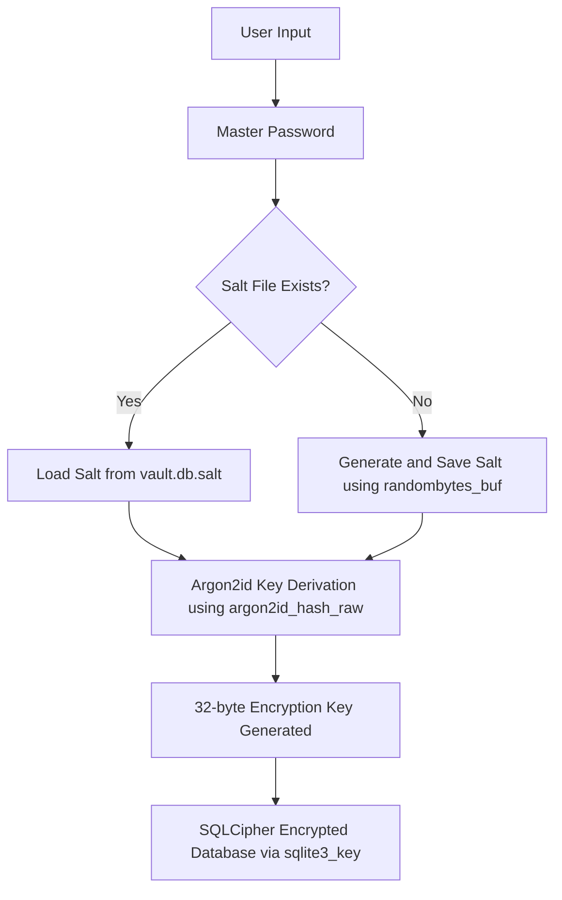

# Security Policy

## Table of Contents
- [Security Overview](#security-overview)
- [Cryptographic Implementation](#cryptographic-implementation)
- [Data Protection](#data-protection)
- [Memory Management](#memory-management)
- [File System Security](#file-system-security)
- [Password Strength Validation](#password-strength-validation)
- [Reporting Security Vulnerabilities](#reporting-security-vulnerabilities)

## Security Overview

SecurePasswd_MGMT is designed with security-first principles and implements defense-in-depth strategies using modern, vetted cryptographic libraries. This document outlines the comprehensive security measures implemented to protect user data.

### Security Goals
- **Confidentiality:** Protect sensitive data using state-of-the-art authenticated encryption.
- **Integrity:** Ensure data has not been tampered with.
- **Privacy:** Local-only storage with no network dependencies.

## Cryptographic Implementation

### Encryption
- **Algorithm:** AES-256
- **Details:** The database is encrypted using SQLCipher, which uses AES-256 in CBC mode by default. The encryption key is passed to the database using the `sqlite3_key` function in `core/database.c`.
- **Library:** **SQLCipher**, a widely-used, open-source library that provides transparent 256-bit AES encryption of SQLite database files.

### Key Derivation Function (KDF)
**Specifications:**
- **Algorithm:** **Argon2id**
- **Details:** Argon2 is the winner of the Password Hashing Competition (2015) and is widely considered the best-in-class KDF. The `id` variant provides a hybrid approach that is resistant to both side-channel and GPU cracking attacks. The key is derived using the `argon2id_hash_raw` function in `core/key_derivation.c`.
- **Library:** The official `libargon2` reference implementation.
- **Parameters:** Secure defaults are used for memory cost (`1 << 16`), time cost (`3`), and parallelism (`1`) to make brute-force attacks computationally infeasible.

### Random Number Generation
- **Source:** Libsodium's `randombytes_buf()` function.
- **Usage:** Salt generation for Argon2 in `core/key_derivation.c`.
- **Quality:** Uses the operating system's best available Cryptographically Secure Pseudorandom Number Generator (CSPRNG), such as `/dev/urandom`.

## Data Protection

### Master Password Security Flow

The following diagram illustrates the process of deriving the encryption key from the master password:

### Data Storage Format
- **Salt File (`vault.db.salt`):** Stores the unique salt used for key derivation. This file is created in the same directory as the database.
- **Database File (`vault.db`):** An encrypted SQLite database containing all the user's data. The encryption is handled by SQLCipher.

## Memory Management

Sensitive data, specifically the master password and the derived encryption key, is explicitly cleared from memory as soon as it is no longer needed. This is done using the `sodium_memzero()` function from `libsodium` in `core/database.c` to prevent sensitive data from being exposed in memory.

## File System Security

- **Secure Permissions:** The application data directory is created with the most restrictive permissions possible (`0700` on Unix-like systems), ensuring only the owner can access it.
- **Default Location:** Data is stored in a standard, OS-specific location (`~/.config/SecurePasswd_MGMT` on Linux, `%APPDATA%\SecurePasswd_MGMT` on Windows) to avoid cluttering user directories.

## Secure Build Process

The project uses **CMake**, a modern and cross-platform build system generator. Security is a primary consideration in the build process.

- **Dependency Management:** CMake's `find_package` and `pkg_check_modules` are used to locate required libraries like Libsodium, Argon2, and SQLCipher, ensuring they are present before building.
- **Compiler Flags:** The following security hardening flags are explicitly set in the `CMakeLists.txt` for production builds on Linux:
  - `-fstack-protector-strong`: Helps prevent stack-based buffer overflows.
  - `-D_FORTIFY_SOURCE=2`: Adds checks for buffer overflows in common library functions.
  - `-Wl,-z,relro,-z,now`: Hardens the binary against certain types of memory corruption attacks.

## Password Strength Validation

### Health Check Requirements

The password health check enforces modern security standards to ensure high-entropy passwords:

**Minimum Requirements:**
- **Length:** 16 characters minimum (exceeds NIST SP 800-63B recommendations)
- **Complexity:** All four character types required:
  - Uppercase letters (A-Z)
  - Lowercase letters (a-z)
  - Numbers (0-9)
  - Special symbols (!@#$%^&*(), etc.)

**Security Validations:**
- **Uniqueness Check:** Detects password reuse across services to prevent lateral attacks
- **Breach Database Check:** Integration with Have I Been Pwned (HIBP) API to identify compromised passwords
- **Entropy Calculation:** 16-character passwords with all character types provide approximately 98.7 bits of entropy, exceeding the NIST 80-bit minimum

### Compliance

Password validation aligns with:
- NIST SP 800-63B (Digital Identity Guidelines)
- OWASP Password Storage Cheat Sheet
- CIS Controls v8 (Password Policy Requirements)
- ISO 27001 (Information Security Management)

## Reporting Security Vulnerabilities

If you discover a security vulnerability, please report it responsibly:

1.  **DO NOT** open a public GitHub issue.
2.  Contact the maintainer directly via a secure channel or use GitHub's private vulnerability reporting feature.
3.  Provide detailed steps to reproduce the vulnerability.

*This security policy is a living document and will be updated as the project evolves.*
