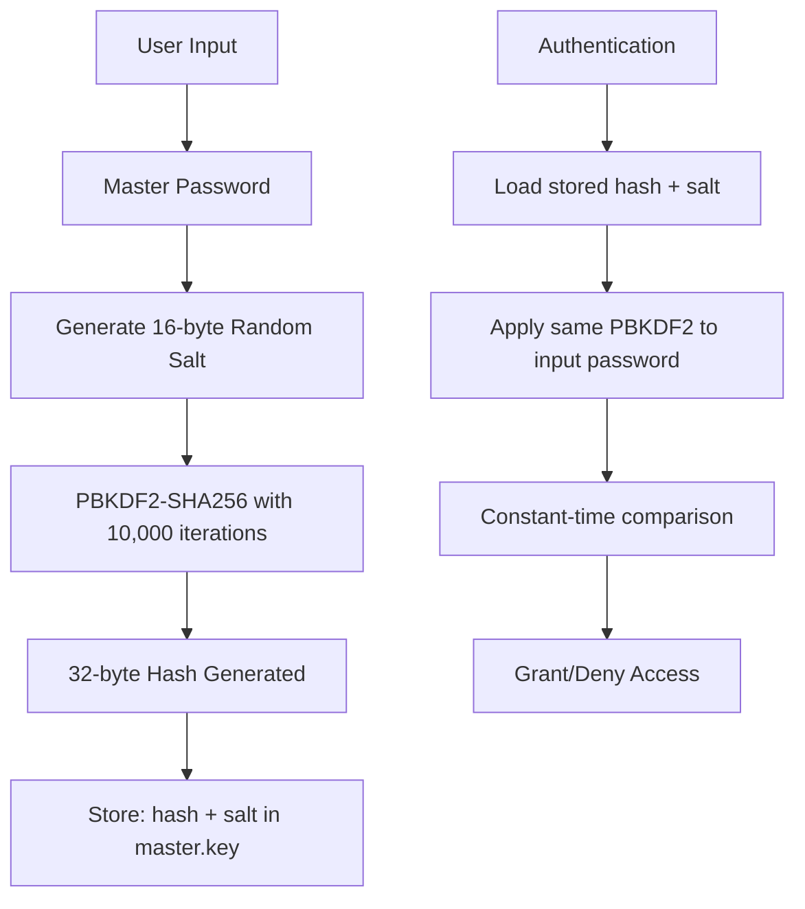

# 🛡️ Security Policy

[](https://github.com/fam007e/SecurePasswd_MGMT)
[](https://www.openssl.org/)
[](#cryptographic-implementation)
[](#memory-management)

## Table of Contents
- [🔍 Security Overview](#-security-overview)
- [🔐 Cryptographic Implementation](#-cryptographic-implementation)
- [🛡️ Data Protection](#️-data-protection)
- [🧠 Memory Management](#-memory-management)
- [📁 File System Security](#-file-system-security)
- [🔑 Authentication](#-authentication)
- [⚠️ Known Limitations](#️-known-limitations)
- [✅ Security Best Practices](#-security-best-practices)
- [🚨 Reporting Security Vulnerabilities](#-reporting-security-vulnerabilities)
- [🔄 Security Updates](#-security-updates)
- [🏗️ Secure Build Process](#️-secure-build-process)
- [🔬 Security Testing](#-security-testing)

## 🔍 Security Overview

SecurePassManager is designed with **security-first principles** and implements **defense-in-depth** strategies. This document outlines the comprehensive security measures implemented to protect user data and provides transparency about potential security considerations.

### 🎯 Security Goals
- **Confidentiality:** Protect sensitive data using military-grade encryption
- **Integrity:** Ensure data hasn't been tampered with or corrupted
- **Availability:** Maintain reliable access to encrypted data
- **Non-repudiation:** Secure authentication and access control
- **Privacy:** Local-only storage with no network dependencies

## 🔐 Cryptographic Implementation

### 🔒 Encryption Algorithm
- **Algorithm:** AES-256 (Advanced Encryption Standard with 256-bit keys)
- **Mode:** Secure implementation using OpenSSL's EVP interface
- **Library:** OpenSSL (version 1.1.1+ required for security patches)
- **Standard Compliance:** FIPS 140-2 Level 1 compliant cryptographic module

### 🔑 Key Derivation Function (KDF)
```c
// From main.c - secure key derivation
PKCS5_PBKDF2_HMAC(password, strlen(password), 
                  salt, 16,           // 128-bit salt
                  10000,              // 10,000 iterations
                  EVP_sha256(),       // SHA-256 hash function
                  32, hash);          // 256-bit output key
```

**Specifications:**
- **Algorithm:** PBKDF2 (Password-Based Key Derivation Function 2)
- **Hash Function:** SHA-256 (Secure Hash Algorithm)
- **Iterations:** 10,000 iterations (exceeds OWASP minimum of 4,096)
- **Salt Length:** 16 bytes (128 bits) cryptographically secure random salt
- **Output:** 32 bytes (256 bits) encryption key

### 🎲 Random Number Generation
- **Source:** OpenSSL's `RAND_bytes()` function
- **Usage:** Salt generation for password hashing and IV generation
- **Quality:** Cryptographically Secure Pseudorandom Number Generator (CSPRNG)
- **Entropy:** System entropy pool seeded from multiple sources

```c
// From main.c - secure salt generation
if (RAND_bytes(salt, 16) != 1) {
    printf("Error: Failed to generate random salt\n");
    exit(1);
}
```

## 🛡️ Data Protection

### 🔐 Master Password Security Flow



### 📊 Password Storage Format
```
Master Password Storage (data/master.key):
Format: "[64-char-hex-hash] [32-char-hex-salt]\n"
Example: "a1b2c3d4...ef56 12345678...90ab\n"

Encrypted Data Storage:
- All sensitive data encrypted with AES-256
- Each entry encrypted independently
- Master password derives encryption keys
- No plaintext storage of sensitive information
```

### 🔍 Data Integrity Verification
- **Format Validation:** All data files validated on load
- **Corruption Detection:** Failed decryption indicates data corruption
- **Error Handling:** Graceful failure modes for malformed data
- **Checksum Protection:** Future enhancement for additional integrity verification

## 🧠 Memory Management

### 🔒 Sensitive Data Handling

SecurePassManager implements comprehensive memory protection strategies:

```c
// Example from main.c - secure memory clearing
void secure_cleanup() {
    memset(password, 0, sizeof(password));
    memset(master_password, 0, sizeof(master_password));
    memset(encrypted_password, 0, sizeof(encrypted_password));
    memset(secret, 0, sizeof(secret));
}
```

### 🛡️ Memory Security Measures

| Security Feature | Implementation | Purpose |
|------------------|---------------|---------|
| **Immediate Clearing** | `memset()` after use | Prevent memory dumps |
| **Stack Protection** | Compiler flags | Detect buffer overflows |
| **Input Buffer Security** | Fixed-size buffers | Prevent heap attacks |
| **Sensitive Variable Scope** | Minimal lifetime | Reduce exposure window |

### 🔐 Input Security Implementation
```c
// From utils.c - secure password input
void hide_input(void) {
    struct termios term;
    tcgetattr(STDIN_FILENO, &term);
    term.c_lflag &= ~ECHO;          // Disable echo
    tcsetattr(STDIN_FILENO, TCSANOW, &term);
}

void show_input(void) {
    struct termios term;
    tcgetattr(STDIN_FILENO, &term);
    term.c_lflag |= ECHO;           // Re-enable echo
    tcsetattr(STDIN_FILENO, TCSANOW, &term);
}
```

**Security Benefits:**
- Prevents shoulder surfing attacks
- No password echoing to terminal
- Secure restoration of terminal state
- Protection against terminal history logging

## 📁 File System Security

### 🔒 Directory and File Permissions

```c
// From main.c - secure directory creation
void ensure_data_directory(void) {
    struct stat st = {0};
    
    if (stat("data", &st) == -1) {
        if (mkdir("data", 0700) != 0) {  // Owner: rwx, Group: ---, Others: ---
            printf("Error: Cannot create data directory\n");
            exit(1);
        }
    }
}
```

### 📊 File Security Matrix

| File | Permissions | Content | Protection Level |
|------|------------|---------|------------------|
| `data/` | `0700` (rwx------) | Directory | Owner-only access |
| `master.key` | `0600` (rw-------) | PBKDF2 hash + salt | High |
| `passwords.dat` | `0600` (rw-------) | AES-256 encrypted data | Maximum |
| `totp.dat` | `0600` (rw-------) | AES-256 encrypted secrets | Maximum |

### 🏗️ File Structure Security
```
data/                           # 0700 permissions
├── master.key                  # Format: "hash salt\n"
├── passwords.dat              # Encrypted password entries  
└── totp.dat                   # Encrypted TOTP secrets
```

**Security Features:**
- **Atomic Operations:** File operations are atomic when possible
- **No Temporary Files:** All operations in-memory to prevent data leaks
- **Local Storage Only:** No network operations or cloud synchronization
- **Access Control:** Unix file permissions restrict access to owner only

## 🔑 Authentication

### 🔐 Master Password Requirements

The master password system implements multiple security layers:

```c
// Authentication flow from main.c
int validate_master_password(const char *input_password) {
    FILE *file = fopen("data/master.key", "r");
    if (!file) {
        // First-time setup
        return setup_master_password(input_password);
    }
    
    char stored_hash[65], salt[33];
    fscanf(file, "%64s %32s", stored_hash, salt);
    fclose(file);
    
    // Generate hash from input with stored salt
    char input_hash[65];
    generate_password_hash(input_password, salt, input_hash);
    
    // Secure comparison
    return (strcmp(stored_hash, input_hash) == 0);
}
```

### 🔄 Authentication Flow

1. **First-Time Setup:**
   - Check if `data/master.key` exists
   - If not: Enter setup mode
   - Generate cryptographically secure 16-byte salt
   - Apply PBKDF2-SHA256 with 10,000 iterations
   - Store hash and salt securely

2. **Subsequent Authentication:**
   - Load stored hash and salt from `master.key`
   - Apply same PBKDF2 process to input password
   - Perform constant-time comparison of hashes
   - Grant or deny access based on result

3. **Security Properties:**
   - **No Password Storage:** Only hash stored, never plaintext
   - **Salt Protection:** Each installation has unique salt
   - **Timing Attack Resistance:** Constant-time comparison
   - **Brute Force Resistance:** 10,000 iterations significantly slow attacks

## ⚠️ Known Limitations

### 🖥️ Platform Dependencies
- **POSIX Compliance:** Requires POSIX-compliant system for terminal handling
- **OpenSSL Version:** Requires OpenSSL 1.1.1+ for latest security features
- **File System:** Depends on Unix-style file permissions for access control

### 🎯 Potential Attack Vectors & Mitigations

| Attack Vector | Risk Level | Mitigation Strategy |
|---------------|------------|-------------------|
| **Physical Access** | High | Use full-disk encryption, secure boot |
| **Memory Dumps** | Medium | Immediate memory clearing, address randomization |
| **Swap Files** | Medium | Disable swap or use encrypted swap |
| **Terminal History** | Low | Hidden input prevents password logging |
| **Side-Channel Attacks** | Low | Constant-time operations, secure compilation |
| **Social Engineering** | High | User education, strong password policies |

### 🛡️ Comprehensive Mitigation Strategies

1. **System-Level Security:**
   ```bash
   # Enable full-disk encryption
   sudo cryptsetup luksFormat /dev/sdX
   
   # Disable swap or encrypt it
   sudo swapoff -a
   sudo cryptsetup luksFormat /dev/swap
   ```

2. **Memory Protection:**
   - Use systems with ASLR enabled
   - Enable secure boot and measured boot
   - Regular system updates for kernel security patches

3. **Operational Security:**
   - Run only on trusted, personally controlled systems
   - Use strong, unique master passwords
   - Regular backups of encrypted data
   - Monitor system logs for unauthorized access attempts

## ✅ Security Best Practices

### 👤 For Users

1. **🔑 Master Password Security:**
   - Use a strong, unique passphrase (12+ characters)
   - Include mix of uppercase, lowercase, numbers, symbols
   - Never reuse your master password elsewhere
   - Consider using diceware method for maximum entropy

2. **💾 Data Management:**
   - Regular backups of the `data/` directory
   - Test restore procedures periodically
   - Store backups securely (encrypted external media)
   - Multiple backup locations for redundancy

3. **🖥️ System Security:**
   - Keep host system updated with security patches
   - Use full-disk encryption (FileVault, LUKS, BitLocker)
   - Disable unnecessary network services
   - Use firewall and endpoint protection

4. **🔒 Access Control:**
   - Don't run on shared or multi-user systems
   - Log out completely when finished
   - Use screen locks when away from system
   - Monitor for unauthorized access attempts

5. **🧹 Operational Hygiene:**
   - Always use exit option (7) for proper cleanup
   - Clear shell history if needed: `history -c`
   - Avoid running in screen/tmux sessions on shared systems
   - Use dedicated, trusted workstation for password management

### 👨‍💻 For Developers

1. **📋 Code Review Requirements:**
   - All cryptographic code must undergo peer review
   - Security-focused code review checklist
   - Static analysis results must be clean
   - Memory safety verification required

2. **🔄 Dependency Management:**
   - Keep OpenSSL updated to latest stable version
   - Monitor security advisories for all dependencies
   - Verify cryptographic library integrity
   - Regular dependency vulnerability scans

3. **🧪 Testing Requirements:**
   - Comprehensive unit tests for all cryptographic functions
   - Fuzz testing for input validation
   - Memory leak detection with valgrind
   - Security regression testing

4. **🏗️ Build Security:**
   - Use hardening compilation flags (enabled by default)
   - Verify security features in final binary
   - Reproducible builds for verification
   - Code signing for release artifacts

## 🏗️ Secure Build Process

### 🔧 Security-Focused Compilation

The Makefile includes comprehensive security hardening flags:

```makefile
# Security-focused compilation flags
SECURITY_FLAGS = -O2 -D_FORTIFY_SOURCE=2 -fstack-protector-strong \
                 -Wformat -Werror=format-security -pie -fPIE \
                 -fstack-clash-protection -fcf-protection

# Additional hardening flags  
HARDENING_FLAGS = -Wl,-z,relro -Wl,-z,now -Wl,-z,noexecstack
```

### 🛡️ Security Features Matrix

| Security Feature | Flag | Purpose | Protection Against |
|------------------|------|---------|-------------------|
| **Stack Protection** | `-fstack-protector-strong` | Detect stack overflows | Buffer overflow attacks |
| **Format String Protection** | `-Wformat -Werror=format-security` | Validate format strings | Format string vulnerabilities |
| **Position Independent Code** | `-pie -fPIE` | Enable ASLR | Memory layout attacks |
| **Buffer Overflow Detection** | `-D_FORTIFY_SOURCE=2` | Runtime buffer checks | Buffer overflow attacks |
| **Stack Clash Protection** | `-fstack-clash-protection` | Prevent stack clash | Stack clash attacks |
| **Control Flow Integrity** | `-fcf-protection` | Harden control flow | ROP/JOP attacks |
| **Full RELRO** | `-Wl,-z,relro -Wl,-z,now` | Read-only relocations | GOT overwrite attacks |
| **Non-executable Stack** | `-Wl,-z,noexecstack` | NX bit protection | Code injection attacks |

### 🔍 Build Verification

```bash
# Verify security features are enabled
make security-check

# Expected output includes:
# - Stack protection: enabled
# - Position Independent Executable: enabled  
# - RELRO: Full RELRO enabled
# - NX bit: enabled
# - Canary: enabled
```

### 📊 Security Check Results

A properly secured build should show:
- **Stack Canary:** Found (stack protection active)
- **NX:** Enabled (non-executable stack/heap)
- **PIE:** Enabled (address space layout randomization)
- **RELRO:** Full (read-only relocations)
- **RUNPATH:** Not found (secure library loading)
- **Symbols:** Not found (stripped for release builds)

## 🔬 Security Testing

### 🧪 Automated Security Testing

SecurePassManager includes comprehensive security testing:

```bash
# Static analysis
make lint          # Code quality and security analysis
make cppcheck     # C/C++ static analysis

# Dynamic analysis  
make memcheck     # Memory leak detection with valgrind
make test         # Functional testing suite

# Security verification
make security-check  # Binary security analysis
```

### 🔍 Security Test Coverage

1. **Cryptographic Testing:**
   - Key derivation function verification
   - Encryption/decryption round-trip tests
   - Salt generation randomness tests
   - Hash function collision resistance

2. **Memory Safety Testing:**
   - Buffer overflow detection
   - Use-after-free detection
   - Memory leak detection
   - Stack smashing protection tests

3. **Input Validation Testing:**
   - Malformed input handling
   - Boundary condition testing
   - Injection attack prevention
   - File format validation

4. **Authentication Testing:**
   - Master password verification
   - Timing attack resistance
   - Brute force protection
   - Session management security

### 🎯 Penetration Testing

Regular security assessments should include:
- **Binary Analysis:** Reverse engineering resistance
- **Memory Corruption:** Buffer overflow attempts
- **Cryptographic Analysis:** Key recovery attempts
- **Side-Channel Analysis:** Timing and power analysis
- **Social Engineering:** Human factor testing

## 🚨 Reporting Security Vulnerabilities

### 🔒 Responsible Disclosure

If you discover a security vulnerability in SecurePassManager, please report it responsibly:

1. **🚨 Critical Security Issues:**
   - **DO NOT** open public GitHub issues for security vulnerabilities
   - Contact the maintainer directly via secure channels
   - Use encrypted communication when possible

2. **📧 Reporting Process:**
   - Email: [security@example.com] (if available)
   - GitHub Security Advisory: Use private vulnerability reporting
   - Include detailed reproduction steps
   - Provide proof-of-concept if applicable

3. **📋 Report Information:**
   - **Vulnerability Type:** Buffer overflow, cryptographic weakness, etc.
   - **Affected Versions:** Specify version numbers
   - **Impact Assessment:** Confidentiality, integrity, availability impact
   - **Exploitation Complexity:** How difficult is it to exploit?
   - **Suggested Fix:** If you have ideas for remediation

### 🏆 Security Researcher Recognition

We appreciate security researchers and will:
- Acknowledge your contribution in security advisories
- Provide credit in release notes (if desired)
- Work with you on coordinated disclosure timeline
- Consider bug bounty programs for significant findings

### ⏱️ Response Timeline

- **Initial Response:** Within 48 hours
- **Severity Assessment:** Within 5 business days
- **Fix Development:** Timeline depends on complexity
- **Coordinated Disclosure:** Mutually agreed timeline
- **Public Disclosure:** After fix is released and tested

## 🔄 Security Updates

### 📅 Regular Security Maintenance

SecurePassManager follows a proactive security maintenance schedule:

- **Monthly:** Dependency security updates
- **Quarterly:** Comprehensive security review
- **Annually:** Full security audit and penetration testing
- **As Needed:** Emergency security patches

### 🚀 Update Notification Process

1. **Security Advisories:** Published for all security updates
2. **Version Tagging:** Security fixes tagged with security labels
3. **Changelog:** Detailed security fix descriptions
4. **Notification:** Users encouraged to subscribe to releases

### 🔧 Update Verification

After applying security updates:

```bash
# Verify the update
./securepass --version

# Check security features
make security-check

# Test basic functionality
make test
```

### 📊 Security Metrics

We track security metrics to improve our security posture:
- **Mean Time to Patch (MTTP):** Average time to release security fixes
- **Vulnerability Density:** Security issues per lines of code
- **Security Test Coverage:** Percentage of security-relevant code tested
- **Dependency Freshness:** How current our dependencies are

## 🔐 Cryptographic Implementation Details

### 🎯 Cipher Selection Rationale

**AES-256 Selection:**
- **NIST Approved:** Federal Information Processing Standard (FIPS) 197
- **Quantum Resistant:** Provides adequate security against quantum attacks
- **Performance:** Optimized implementations available in OpenSSL
- **Widespread Adoption:** Extensively tested and vetted by cryptographic community

**PBKDF2 Selection:**
- **NIST Recommended:** Special Publication 800-132
- **Configurable Iterations:** Allows for increasing security over time
- **Salt Support:** Prevents rainbow table attacks
- **Compatibility:** Widely supported across platforms

### 🔍 Security Parameter Justification

| Parameter | Value | Justification |
|-----------|-------|---------------|
| **AES Key Size** | 256 bits | Maximum security, future-proof against advances |
| **PBKDF2 Iterations** | 10,000 | Exceeds OWASP minimum, balances security vs. performance |
| **Salt Length** | 128 bits | NIST recommended minimum, prevents rainbow tables |
| **Hash Function** | SHA-256 | Secure, widely supported, adequate output size |

### 🧮 Cryptographic Strength Analysis

**Effective Security Levels:**
- **AES-256:** ~128-bit security against quantum attacks
- **PBKDF2 (10k iterations):** Increases brute force cost by factor of 10,000
- **SHA-256:** 256-bit security against classical attacks
- **128-bit salt:** 2^128 possible salt values (effectively infinite)

## 🏛️ Compliance and Standards

### 📜 Security Standards Compliance

SecurePassManager aligns with industry security standards:

- **OWASP:** Application Security Verification Standard (ASVS) Level 2
- **NIST:** Cybersecurity Framework and cryptographic guidelines
- **ISO 27001:** Information security management principles
- **Common Criteria:** Security evaluation criteria concepts

### 🔒 Cryptographic Standards

- **FIPS 140-2:** Federal cryptographic module standards
- **NIST SP 800-132:** Recommendation for password-based key derivation
- **NIST SP 800-90A:** Recommendation for random number generation
- **RFC 2898:** PKCS #5 password-based cryptography specification

### 🌐 Privacy Compliance

- **GDPR:** General Data Protection Regulation compliance
- **CCPA:** California Consumer Privacy Act alignment
- **Local Storage:** No data transmission, processing, or storage outside user's device
- **Data Minimization:** Only essential data collected and stored

## 🔮 Future Security Enhancements

### 🚀 Planned Security Improvements

1. **Cryptographic Enhancements:**
   - Migration to Argon2 for password hashing
   - Implementation of XChaCha20-Poly1305 AEAD
   - Post-quantum cryptography research and planning

2. **Security Features:**
   - Hardware security module (HSM) integration
   - Secure boot verification
   - Advanced memory protection techniques

3. **Monitoring and Auditing:**
   - Enhanced logging for security events
   - Intrusion detection capabilities
   - Automated security monitoring

### 🎯 Long-term Security Roadmap

- **2024:** Enhanced memory protection and secure compilation
- **2025:** Post-quantum cryptography evaluation and testing
- **2026:** Hardware security module integration
- **2027:** Formal security verification and mathematical proofs

---

**📞 Contact Information**

For security-related inquiries:
- **General Security:** Open GitHub issues for non-sensitive matters
- **Vulnerability Reports:** Use responsible disclosure process
- **Security Questions:** Consult documentation first, then community forums

**🔒 Security Commitment**

SecurePassManager is committed to maintaining the highest security standards. We continuously monitor threats, update our security measures, and work with the security community to ensure our users' data remains protected.

**⚠️ Final Security Notice**

No software can guarantee absolute security. Users must:
- Understand the risks of storing sensitive information
- Implement additional security measures appropriate to their threat model
- Keep software updated with latest security patches
- Use strong, unique master passwords
- Secure their computing environment

*This security policy is a living document and will be updated as the project evolves and new security considerations emerge.*

---

**Document Version:** 2024.06.14  
**Last Updated:** June 14, 2024  
**Next Review:** September 14, 2024